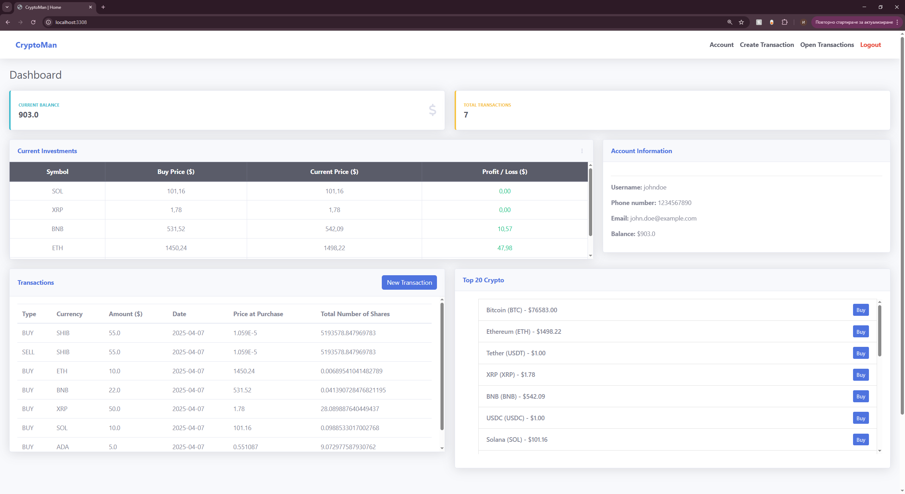

# CRYPTOMAN

**CRYPTOMAN** is a user-friendly digital cryptocurrency trading platform. It allows users to effortlesly buy and sell crypto with the
push of a button. CryptoMan implements API for the latest crypto prices, the API being refreshed every 60 seconds. It includes
feautures such as crypto buying and selling, transaction history, reseting your account back to the starting position and many more.

## Team Members
**Ivan Georgiev** – [ivan200126y](https://github.com/ivan200126y)

## Features
**Buy crypto** - Buy based on the $ amount you want to purchase, not the exact number of shares.
**Partial or Full Sell of Positions** - You're able to close your full holdings in a given cryptocurrency or only partially.
**Transaction History** - View all of your transactions, open and closed
**Open Transactions** - View your current open positions, along with the purchase price, current price and the profit or the 
loss you have on the position.
**Crypto Prices** - View the real-time prices on the top-20 crypto currencies around the world, with the prices being updated
every minute.
**Sort & Filtering** - View all transactions and filter them based on start & end-date, and transaction type. Also 
sort by amount & date (in ascending and descending order)

## Installation
1. **Clone the repository** on your computer and install the dependencies in build.gradle
2. **Make sure** you have JDK 17 and MariaDB installed
3. **Run the create.sql** and insert-data.sql script located at /Virtual Wallet/db
4. Access the application at this url - http://localhost:3308

## Configuration
**The current configuration has changed and will not work for you due to privacy reasons.
That's why before running the app, in order to use some of the functionalities you must configure 
application.properties.**

Navigate to:
src/main/resources/application.properties

And modify the following properties:
# Database Configuration
spring.datasource.url=jdbc:mariadb://localhost:3306/virtual_wallet
spring.datasource.username=root
spring.datasource.password={yourpassword}

# Email verification
spring.mail.username={sender_email_username}
spring.mail.password={sender_email_password}

# API Keys
cloudinary.cloud-name={your_cloud_name}
cloudinary.api-key={your_api_key}
cloudinary.api-secret={your_api_secret}

## Login Details
**The provided credentials are for testing purposes only!**

**Admin**: username: johndoe, password: johndoe
**User**: username: alicesmith, password: alicesmith

## Technologies
Java 17
Spring Boot
Spring MVC
Spring Data JPA
Gradle
SQL
MariaDB
Thymeleaf
HTML5
CSS
JavaScript
JUnit
Mockito

## Functionalities
**Main Page**

**Open Transactions**

**Create Transaction**

**Account**

**About**

**Transactions**

**Register**

**LogIn**

**Database Schema**
